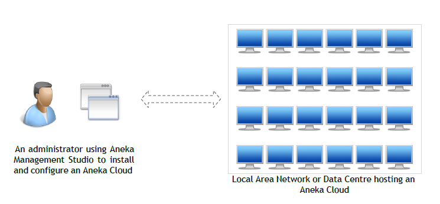
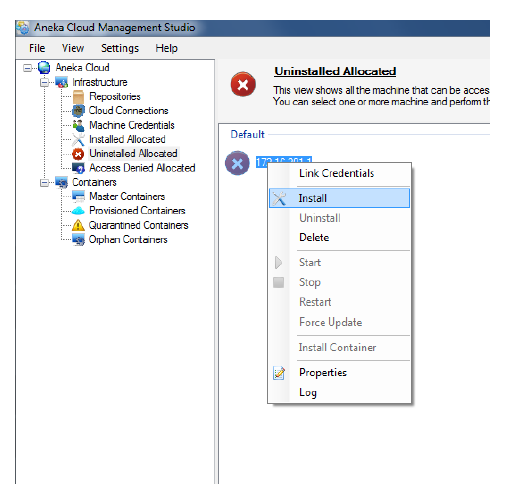
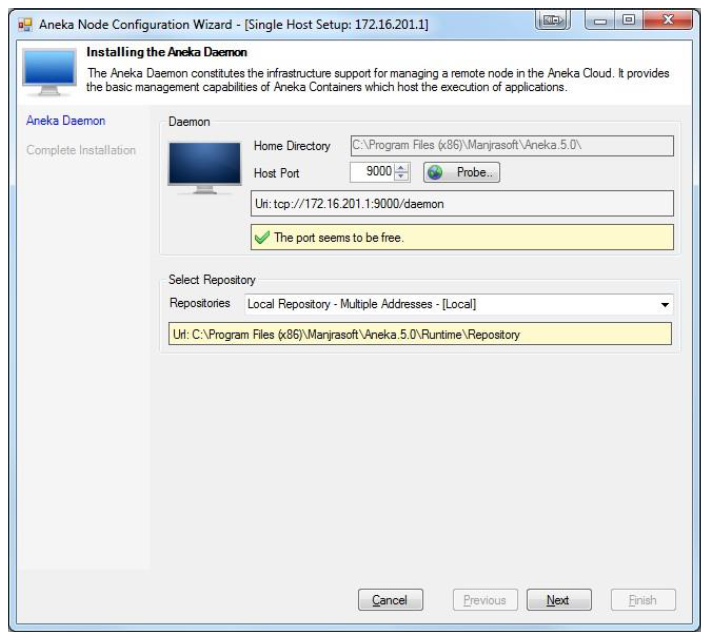
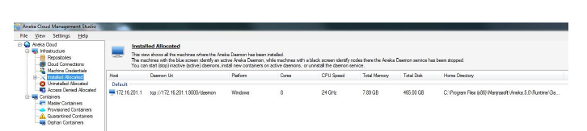

---
hide:
  - navigation
#  - toc
---

# Aneka Desktop Clouds
Aneka Cloud Application Platform (CAP) can be set up to manage a collection of services deployed atop an infrastructure. This infrastructure may encompass physical machines (such as desktops) situated within your local area network, typically found in your laboratory environment. Aneka Management Studio serves as the tool for configuring these clouds.
<figure markdown="span">
  { width="600" }
  <figcaption>Aneka Management Studio</figcaption>
</figure>

## Requirements
### Minimum hardware requirements:
* A desktop with dual core processor with 1GB of RAM and 10GB of Storage
* Machine/Machines should be LAN Connected and with static IPs.
* We need minimum 03 machines to seup the cluster.

### Software requirements:
* Windows (Windows 7, Windows 8, Windows 8.1, Windows 10, Windows Server 2008, Windows Server 2012) Operating System, either 32-bit or 64-bit.
* All PC with .NET Framework 4.5 or higher
* Microsoft visual studio community edition 2019  or later for development.

## Prerequisites
Prior to setting up the Ankea Desktop clouds, ensure you have the following prerequisites prepared:

- [x] IP addresses of all the desktop machines intended to be added to the cluster should be collected beforehand.
- [x] An `Administrator` username should be enbaled on all the machines and set the password.
- [x] Each machine should have a unique hostname assigned to it.
- [x] Disable the (Private & Public) Windows firewall on each machine.
- [x] Ensure that each machine has .Net 4.5 installed (Note: Windows 7 and 8 come with .Net 4.5 pre-installed by default).
- [x] All machines should be accessible from each other (i.e., when you ping machines from each other including from masters to other workers PCs/VMs should be working).

## Installing Aneka Clouds
This section assumes that you have a copy of the Aneka distribution with you. If you do not have a copy already, you can download the latest version from Manjrasoft’s Website.

### Installing Aneka Management Studio
Aneka installation begins with installing Aneka Cloud Management Studio. The Cloud Management Studio is your portal for creating, configuring and managing Aneka Clouds. Installing Aneka using the distributed Microsoft Installer Package (MSI) is a quick process.

* Navigate to the directory where the downloaded Aneka installer file (`Aneka*.msi`) is located, then double-click on the file to initiate the installation process. Follow the prompts until the installation is complete.

* Following the installation, you should find the Aneka-related files located at `C:\Program Files (x86)\Manjrasoft\Aneka.5.0`.

* Take a look inside the folder containing the files used to set up the Aneka clouds.
??? note "Info about folders"
    1. The `Docs` folder contains a set of PDF files utilized as documentation for learning Aneka setup and programming.
    2. The `Examples` folder includes sample examples developed using Aneka Thread, Task, and MapReduce APIs, accompanied by source code in both C# and Visual Basic.
    3. The `RunTime` folder contains the dll's used to install Aneka Deamon and Containers.
    4. The `Tools` folder contains the sub folders with `SDK` and  `Managment Studio` files used to setup and application development.
* Open by double click *Aneka Management Studio* application located at `C:\Program Files (x86)\Manjrasoft\Aneka.5.0\Tools\Management Studio\Aneka.UI.Manager`
* Press `No` (Do you want to provide a different configuration) on pop up displayed after opening the application.
* Press `No` for Local Repository creation.
* Now, you should see the Aneka Managment Explorer.
* Let us, look and study overview of Explorer.
    1.  `Repositories`: Contains the list of local and remote repositories used configure the Aneka deamon and containers. Now, create a remote repo as described below:
    ??? note "Create a remote repository"
        1. Navigate to `Repositories` then right-click and choose `Add`.
        2. Add the infromation on the pop displayed:
            1. Name: Give some name. Ex: Repo-1
            2. Method: `Windows File Share`
            3. Access URL: `\\IP_Address_other_machine\C$\Aneka`
            4. Username: `Administrator`
            5. Password: `""`
        3. Click ok and wait for 1 to 2 minutes.
    2. `Cloud Connections` : You can add multiple resource pools such as AWS, Azure and Gogrid.
    3. `Machine Credentials` : Credentials used to access the machines the cloud.
        1. Right Click and Add, Insert `Username` with password that you have set for the machine(Ex: Username-Administrator, Password-"Your password") 
    4. `Installed Allocated` : List of machines added in to the cluster.
    5. `Uninstalled Allocated` : The list displays machines reachable by the Management Studio, however, no Aneka daemons are currently running on them.
    6. `Access Denied Allocated` : The list includes machines that are currently unreachable and do not have permission to access the services. 
### Adding machines to Aneka Cluster
This section provides an step by step guide to adding machines in to Aneka Cluster.

* Navigate to Aneka Managment Explorer and click on `File-->Add Machine`. By now a window will pop up and the values as mentioned below.
    1. Host or IP : Add IP address of same machine or other machine. If this first time, than better to add the same machine.
    2. Click Ok 

* Navigate to the `Access Denied Allocated` section where you'll find machines marked with a "?" symbol. This symbol indicates that the machine is reachable but lacks permission to access the services.
!!! warning " If you encounter any error symbols other than the "?" symbol, refer to the Troubleshooting section for assistance." 

* Right click on machine and move on to `Link Credentials` and choose the username with administrator. 
    <figure markdown="span">
    { width="500" }
    <figcaption>Image caption</figcaption>
    </figure>

* After adding `Link Credentials`, you should see the machine in `Uninstalled Allocated` section with red color cross mark. Right click on this and choose `install`  
    <figure markdown="span">
    { width="500" }
    <figcaption>Install</figcaption>
    </figure>
    1. Choose repository and port: By default port number will be 9000 and system will automatically check for its freeness. Fo repository select `Local Repo` if the machine is locahost or else choose the Repo that you have created in the previous section.
        <figure markdown="span">
    { width="500" }
    <figcaption>Installing Aneka Deamon</figcaption>
    </figure>
    2. Click on Next and Finish.
* Once Aneka deamon in installed, you should see the machine in `Installed Allocated`.    
    <figure markdown="span">
    { width="500" }
    <figcaption>Installed machine</figcaption>
    </figure>

!!! success "Sucessfully added a machine to Aneka Cluster"
    Now you can add the remaining machines in to the cluster in a similar fashion.

### Installing the Master
This video provides an step by step guide to install Aneka Master.
<iframe width="580" height="340" src="https://www.youtube.com/embed/4pdW9WJ46rI" title="aneka master" frameborder="0" allow="accelerometer; autoplay; clipboard-write; encrypted-media; gyroscope; picture-in-picture; web-share" allowfullscreen></iframe>

### Installing the Worker
This video provides an step by step guide to install Aneka worker.
<iframe width="580" height="340" src="https://www.youtube.com/embed/sa_1Sx50-zM" title="Creating Aneka worker" frameborder="0" allow="accelerometer; autoplay; clipboard-write; encrypted-media; gyroscope; picture-in-picture; web-share" allowfullscreen></iframe>

!!! success "Sucessfully created a Aneka Master and Worker"
    Now you can add the remaining machines as a `workers` in to the cluster in a similar fashion.

